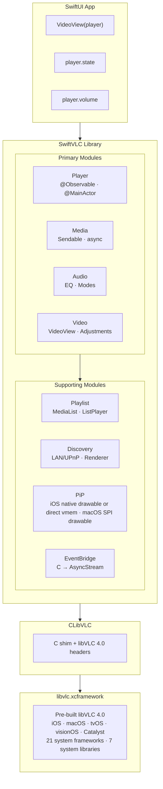
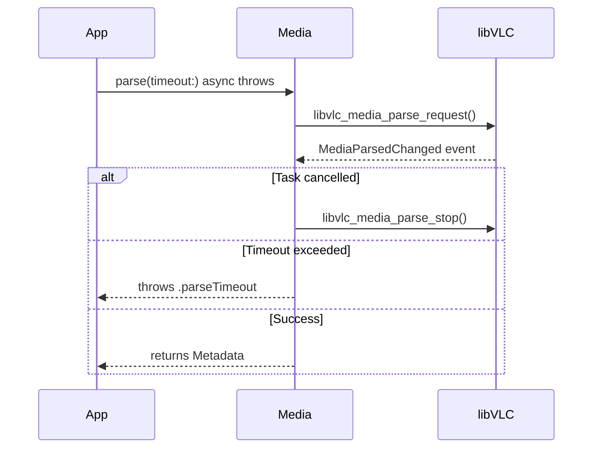
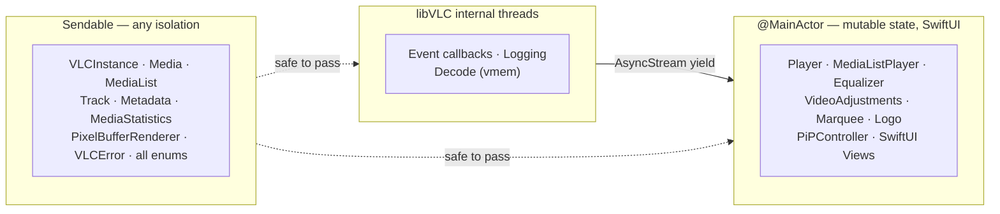
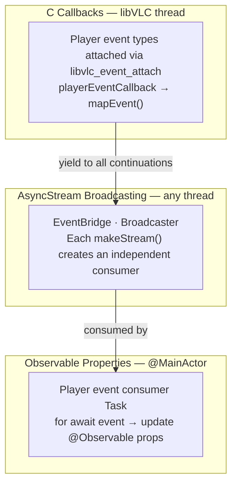
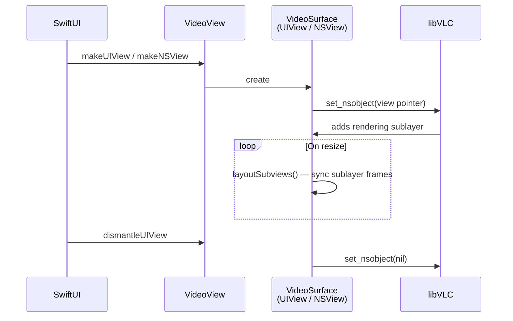
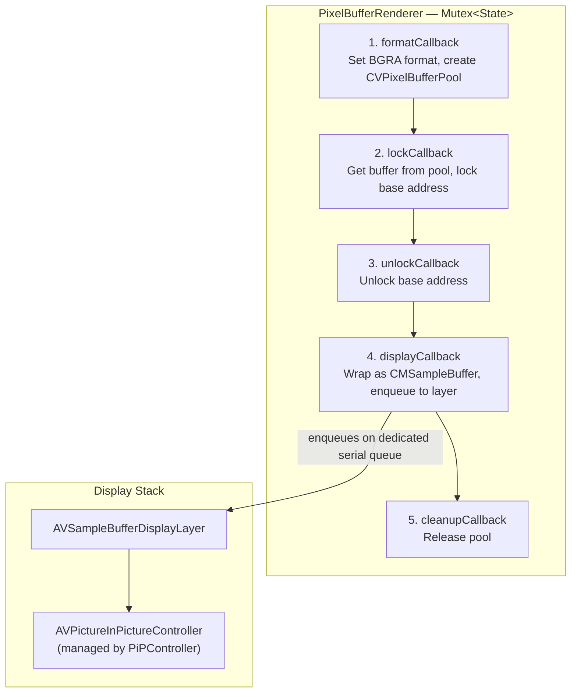

# Architecture

Technical decisions and design rationale for SwiftVLC, written for
contributors and reviewers.

> Looking for **how to use** SwiftVLC? See the DocC guides (published on
> Swift Package Index) or run `swift package preview-documentation
> --target SwiftVLC` locally. This document covers the *why* behind the
> design: build/release infrastructure, C-interop patterns, isolation
> choices, deinit ordering, and the testing strategy.

## Contents

- [High-Level Overview](#high-level-overview)
- [Tech Stack](#tech-stack)
- [Module Architecture](#module-architecture)
- [C Interop Layer](#c-interop-layer)
- [Concurrency & Threading Model](#concurrency--threading-model)
- [Event System](#event-system)
- [Memory Management](#memory-management)
- [Video Rendering](#video-rendering)
- [Picture-in-Picture](#picture-in-picture)
- [Error Handling](#error-handling)
- [Testing Strategy](#testing-strategy)
- [Build & Release Infrastructure](#build--release-infrastructure)
- [Project Structure](#project-structure)

---

## High-Level Overview



**Key concepts:**

- **Swift-first**: Direct C → Swift bindings, no Objective-C intermediary (unlike VLCKit)
- **Observable state**: `@Observable` `@MainActor` Player drives SwiftUI updates automatically
- **Typed concurrency**: Swift 6 strict concurrency. Main-actor types own UI-adjacent C resources, and cross-actor resource/value types are `Sendable`.
- **One-liner rendering**: `VideoView(player)` covers the setup, delegate wiring, and callbacks in one call.
- **Typed errors**: `throws(VLCError)` for compile-time error handling

---

## Tech Stack

| Component | Choice | Why |
|---|---|---|
| **Language** | Swift 6.3+ with Xcode 26.4+ | Strict concurrency, typed throws, `@Observable`, upcoming feature flags |
| **C Bindings** | libVLC 4.0 C API | Direct access, no Objective-C overhead |
| **State** | `@Observable` / `@MainActor` | Automatic SwiftUI integration, thread safety |
| **Events** | `AsyncStream<PlayerEvent>` | Native structured concurrency, multi-consumer |
| **Video** | `UIView` / `NSView` via `set_nsobject` | Platform-native rendering, zero-copy |
| **PiP** | iOS `PiPVideoView`: native drawable; direct controller: vmem → `AVSampleBufferDisplayLayer`; macOS view: native drawable behind SPI | Public iOS PiP, a public direct sample-buffer route, plus explicit private-API macOS opt-in |
| **Thread Safety** | `Mutex<T>`, `Sendable`, `nonisolated(unsafe)` | Compile-time data race prevention |
| **Testing** | Swift Testing framework | Modern `@Test`, `#expect`, tags, traits |
| **Platforms** | iOS 16+, macOS 15+, tvOS 18+, visionOS 2+, Mac Catalyst 18+ | Per-platform minimums |

---

## Module Architecture

### Core

Foundation types shared across all modules.

| File | Type | Purpose |
|---|---|---|
| `VLCInstance.swift` | `final class VLCInstance: Sendable` | Manages `libvlc_instance_t*` lifecycle. Singleton `shared` or custom with arguments. Owns the per-instance `dialogRegistration` Mutex. |
| `VLCError.swift` | `enum VLCError: Error, Sendable, Equatable, Hashable, LocalizedError, CustomStringConvertible` | Typed errors with hand-rolled per-case accessors (`error.parseTimeout`, `error.mediaCreationFailed`, …). Auto-synthesized `Equatable`/`Hashable` over `String` payloads. |
| `Broadcaster.swift` | `final class Broadcaster<Element: Sendable>` | Internal multi-consumer fan-out used by the dialog, renderer, log, player-event, and playback-intent streams. Exposes `subscribe`, `broadcast`, `finishAll` (allows resubscribe) and `terminate` (permanent — future `subscribe` calls return immediately-finished streams) inside the module. Lifecycle reconciliation runs on a private serial queue. |
| `DialogHandler.swift` | `final class DialogHandler: Sendable` | Bridges libVLC's dialog callbacks (`login`, `question`, `progress`, `error`) onto a `Broadcaster<DialogEvent>`. `DialogID` carries the dialog handle through `DialogIDStorage` for safe `dismiss()` + post calls. |
| `Logging.swift` | `AsyncStream<LogEntry>` via `LogBroadcaster` | Filterable log stream backed by `Broadcaster<LogEntry>`. C shim formats `va_list` before Swift callback. `LogNoiseFilter` demotes known-noisy libVLC errors to warnings. |
| `Signposts.swift` | `enum Signposts` | Process-wide `OSSignposter` for `org.swiftvlc` subsystem. Hot paths (`Broadcaster.broadcast`, `Player.handleEvent`, `EventBridge.callback`, `PixelBufferRenderer.outputPixelBuffer`) emit signposts visible in Instruments. Zero cost when no profiler is attached. |
| `Duration+Extensions.swift` | Extensions on `Duration` | `milliseconds`, `microseconds` properties and `formatted` display string |

**Default VLC arguments:** `["--no-video-title-show", "--no-snapshot-preview"]`. `--no-stats` is *not* in the defaults — leaving it on would silently zero every `Media.statistics()` read, which is almost never what a caller wants. On macOS the default keeps VLC's Apple sample-buffer display available for inline playback, including its paired subtitle layer. The private native-drawable PiP backend is present for explicitly opted-in non-App-Store builds, but it is SPI and disabled by default.

### Player

The central observable type that drives all playback.

| File | Type | Purpose |
|---|---|---|
| `Player.swift` | `@Observable @MainActor class` | Wraps `libvlc_media_player_t*`. Lifecycle, drawable management, media loading, and core playback control. Extension files group audio, chapters, events, overlays, programs, recording, typed values, and native-lifecycle helpers. |
| `Player+Events.swift` | `extension Player` | The libVLC event-consumer task and `handleEvent(_:)` dispatch — pause-transition state machine, deferred-pause command, native-state probing, media-derived state reset. |
| `Player+Audio.swift` | `extension Player` | Audio-output device selection, role, mix mode, stereo mode. |
| `Player+Chapters.swift` | `extension Player` | Title/chapter navigation, DVD menu actions. |
| `Player+ABLoop.swift` | `extension Player` | A-B loop state plus checked time/position mutations. |
| `Player+Programs.swift` | `extension Player` | DVB/MPEG-TS program selection, renderer targeting, mid-playback `recast(to:)`, and scrambled-state polling. |
| `Player+Recording.swift` | `extension Player` | Snapshot capture and recording start/stop. |
| `Player+Overlays.swift` | `extension Player` | Scoped `withMarquee`/`withLogo`/`withAdjustments` accessors for the `~Copyable ~Escapable` overlay types. |
| `Player+Typed.swift` | `extension Player` | Typed read-only accessors for raw `position`/`volume`/`rate`/`subtitleTextScale`, plus explicit checked mutation methods such as `setPlaybackRate(_:)`. |
| `PlaybackValues.swift` | 5 typed wrapper structs | `PlaybackPosition`, `Volume`, `PlaybackRate`, `SubtitleScale`, `EqualizerGain`. Each is `Sendable, Hashable, Comparable, ExpressibleByFloatLiteral`, clamps finite input to its valid range, and maps `NaN` to a safe named default. |
| `EventBridge.swift` | `internal class` | C callbacks → `Broadcaster<PlayerEvent>` multi-consumer broadcaster. |
| `PlayerState.swift` | `enum PlayerState` | `.idle`, `.opening`, `.buffering`, `.playing`, `.paused`, `.stopped`, `.stopping`, `.error`. Buffer fill is exposed separately as `Player.bufferFill` so `.paused` players still publish progress. |
| `PlayerEvent.swift` | `enum PlayerEvent` | Typed Swift cases mapped from libVLC's player event types. Hand-rolled per-case accessors (`event.stateChanged`, `event.timeChanged`, …). |
| `PlayerRole.swift` | `enum PlayerRole` | Audio behavior hints: `.music`, `.video`, `.communication`, `.game`, etc. |
| `ABLoop.swift` | `enum ABLoopState` | `.none` → `.pointASet` → `.active` |
| `NavigationAction.swift` | `enum NavigationAction` | DVD/Blu-ray menu: `.activate`, `.up`, `.down`, `.left`, `.right`, `.popup` |
| `Program.swift` | `struct Program` | DVB/MPEG-TS program: id, name, isSelected, isScrambled |

**Player API surface:**

```swift
// Observable properties (auto-update SwiftUI)
player.state              // PlayerState
player.currentTime        // Duration
player.duration           // Duration?
player.isSeekable         // Bool
player.isPausable         // Bool
player.currentMedia       // Media?
player.audioTracks        // [Track]
player.videoTracks        // [Track]
player.subtitleTracks     // [Track]

// Playback observations
player.position           // Double (0.0–1.0), read-only
player.volume             // Float (0.0–2.0), read-only requested volume shadow
player.rate               // Float (current libVLC rate), read-only
player.audioDelay         // Duration, read-only
player.subtitleDelay      // Duration, read-only
player.subtitleTextScale  // Float, read-only

// Mutable properties
player.isMuted            // Bool
player.selectedAudioTrack // Track?
player.selectedSubtitleTrack // Track?
player.aspectRatio        // AspectRatio

// Checked mutations for read-only playback observations
try player.seek(to: PlaybackPosition(0.5))
try player.setAudioVolume(0.8)
try player.setPlaybackRate(1.5)
try player.setAudioDelay(.milliseconds(30))
try player.setSubtitleDelay(.milliseconds(-100))
player.setSubtitleScale(1.25)

// Playback control
try player.play(url: someURL)
player.pause()
player.resume()
try player.seek(to: .seconds(30))
try player.seek(by: .seconds(-10))
player.stop()

// Advanced
try player.setABLoop(a: .seconds(10), b: .seconds(20))
try player.takeSnapshot(to: path, width: 320, height: 240)
player.startRecording(to: directoryPath)
try player.updateViewpoint(Viewpoint(yaw: 90, pitch: 0, roll: 0, fieldOfView: 80))
```

### Media

Media resource creation, parsing, and metadata.

| File | Type | Purpose |
|---|---|---|
| `Media.swift` | `final class Media: Sendable` | Wraps `libvlc_media_t*`. Create from URL, path, or file descriptor. Async parsing with cancellation. |
| `Metadata.swift` | `struct Metadata: Sendable` | libVLC's metadata keys surfaced as typed properties (title, artist, album, duration, artworkURL, genre, …) |
| `Track.swift` | `struct Track: Sendable` | Audio/video/subtitle track info with type-specific fields (channels, resolution, encoding) |
| `ThumbnailRequest.swift` | Extension on `Media` | `thumbnail(at:width:height:crop:timeout:) async throws → Data` |
| `MediaStatistics.swift` | `struct MediaStatistics: Sendable` | Runtime stats: decoded/displayed/lost frames, bitrates, buffer counts |

**Parsing flow:**



### Audio

Audio output, equalization, and channel configuration.

| File | Type | Purpose |
|---|---|---|
| `AudioOutput.swift` | `struct AudioOutput`, `struct AudioDevice` | Available output modules and devices. Extensions on `VLCInstance` and `Player`. |
| `Equalizer.swift` | `@Observable @MainActor class Equalizer` | 10-band EQ with preamp (-20 to +20 dB). libVLC's built-in presets. Attach via `player.equalizer`; mutations re-apply automatically. |
| `AudioChannelMode.swift` | `enum StereoMode`, `enum MixMode` | Stereo/mono/Dolby, 4.0/5.1/7.1/binaural mixing |

### Video

Video rendering, overlays, and adjustments.

| File | Type | Purpose |
|---|---|---|
| `VideoView.swift` | SwiftUI `UIViewRepresentable` / `NSViewRepresentable` | One-liner: `VideoView(player)`. Platform-specific `VideoSurface` underneath. |
| `AspectRatio.swift` | `enum AspectRatio` | `.default`, `.ratio(w, h)`, `.fill` |
| `VideoAdjustments.swift` | `@MainActor struct VideoAdjustments` | brightness, contrast, hue, saturation, gamma — accessed via `player.adjustments` |
| `Marquee.swift` | `@MainActor struct Marquee` | Scrolling text overlay: text, color, opacity, position, timeout |
| `Logo.swift` | `@MainActor struct Logo` | Image overlay: file path, position, opacity, animation |
| `Viewpoint.swift` | `struct Viewpoint: Sendable` | 360° video: yaw, pitch, roll, fieldOfView (degrees) |

### Playlist

Playlist management and sequential/looped playback.

| File | Type | Purpose |
|---|---|---|
| `MediaList.swift` | `final class MediaList: Sendable` | Thread-safe list wrapping `libvlc_media_list_t*`. Append/insert/remove with internal locking. |
| `MediaListPlayer.swift` | `@MainActor class MediaListPlayer` | Sequential playback with `play(at:)`, `next()`, `previous()` |
| `PlaybackMode.swift` | `enum PlaybackMode` | `.default`, `.loop`, `.repeat` |

### Discovery

Network service and renderer discovery.

| File | Type | Purpose |
|---|---|---|
| `MediaDiscoverer.swift` | `final class MediaDiscoverer: Sendable` | Discovers media on LAN/SMB/UPnP/SAP. Returns `MediaList` of found items. |
| `RendererDiscoverer.swift` | `final class RendererDiscoverer: Sendable` | Discovers renderer devices exposed by libVLC plugins. `AsyncStream<RendererEvent>` for add/remove. |

### PiP (iOS/macOS only)

Picture-in-Picture uses the platform path that best matches libVLC's
video output. `PiPVideoView` uses libVLC's native drawable integration on
iOS. Instantiating `PiPController` directly instead installs public vmem
callbacks and exposes an `AVSampleBufferDisplayLayer`. macOS has a
native-drawable backend behind `PrivateMacOSPiP` SPI because the public
sample-buffer mirror crops incorrectly on supported macOS releases.

| File | Type | Purpose |
|---|---|---|
| `PiPController.swift` | `@MainActor class PiPController` | PiP lifecycle, timebase sync, deferred-pause state machine, native-state observer task. |
| `PiPController+Delegate.swift` | extension + private `PiPPlaybackDelegateProxy` | `AVPictureInPictureControllerDelegate` conformance plus the sample-buffer playback delegate proxy that breaks AVKit's strong-retain cycle (AVKit captures the playback delegate strongly even though the header declares it `weak`). Also hosts the `pipMainActorSync` helper for non-main AVKit callbacks that need synchronous main-actor answers. |
| `PiPController+AudioSession.swift` | extension | Configures the iOS playback category at construction, defers activation until playback/PiP intent, and retries after transient activation failure. |
| `PiPController+PlaybackState.swift` | extension | Payload-driven AVKit range invalidation and seekability-to-linear-playback policy that is independent of `Player` subscriber ordering. |
| `PiPControllerBindingPublication.swift` | `@MainActor` helper | Defers representable binding writes, rejects stale generations, and clears only the controller identity published by that view lifecycle. |
| `PiPVideoView.swift` | SwiftUI representable | Owns `PiPVideoView(player, controller: $binding)` construction, player swaps, coordinator lifetime, and platform host attachment without embedding backend implementation details. |
| `PiPVideoView+iOSNative.swift` | iOS native drawable plumbing | Drawable proxy and layout, generation-gated off-main callbacks, libVLC media controls, and the backend that wraps libVLC's system PiP controller for state and control. |
| `PiPVideoView+MacPrivate.swift` | macOS-only private API plumbing | `MacNativePiPBackend` orchestrates `MacPrivatePiPPresenter` (dynamic loader for `PIPViewController` from `PIP.framework`), `MacPrivatePiPDelegate`, and `MacNativePiPMediaController`. All private-framework symbol references live in this one file for security/audit review. Gated by `PiPController.allowsPrivateMacOSAPI` SPI. |
| `PixelBufferRenderer.swift` | `class PixelBufferRenderer: Sendable` | Direct sample-buffer path: format → lock → unlock → display. `CVPixelBufferPool` → `CMSampleBuffer` → layer. |

---

## C Interop Layer

### CLibVLC Target

```
Sources/CLibVLC/
├── include/vlc/          # Full libVLC 4.0 C headers
│   ├── vlc.h             # Main umbrella header
│   ├── libvlc.h          # Instance, logging, dialogs
│   ├── libvlc_media.h    # Media creation, parsing, metadata
│   ├── libvlc_media_player.h  # Player, tracks, events
│   ├── libvlc_media_list.h    # Playlist
│   ├── libvlc_media_discoverer.h  # Network discovery
│   ├── libvlc_renderer_discoverer.h  # Renderer discovery
│   ├── libvlc_picture.h  # Thumbnail generation
│   └── libvlc_events.h   # Event types
└── shim.c                # C shim for va_list formatting
```

### Why a C Shim?

Swift cannot directly consume C variadic functions (`va_list`). The shim provides:

```c
// shim.c — formats va_list into a fixed buffer before calling Swift
void swiftvlc_log_set(libvlc_instance_t *instance, void *opaque,
                       swiftvlc_log_cb callback);
```

This allows the logging callback to receive a pre-formatted `const char *` instead of a `va_list`.

### Linked Frameworks & Libraries

The xcframework links against the system frameworks and libraries
libVLC needs for decoding, rendering, and platform services:

**Frameworks:** AudioToolbox, AudioUnit\*, AVFoundation, AVKit, CoreAudio, CoreFoundation, CoreGraphics, CoreImage, CoreMedia, CoreServices, CoreText, CoreVideo, Foundation, IOKit\*, IOSurface, OpenGL\*, OpenGLES\*, QuartzCore, Security, SystemConfiguration, VideoToolbox

**Libraries:** libbz2, libc++, libiconv, libresolv, libsqlite3, libxml2, libz

\*Platform-conditional: AudioUnit/IOKit/OpenGL are macOS-only; OpenGLES is iOS/tvOS/visionOS-only.

---

## Concurrency & Threading Model

### Isolation Strategy



**Rules:**

1. **`@MainActor` types** own mutable state that SwiftUI observes. All property access and mutation happens on the main actor.
2. **`Sendable` types** are either immutable value types or use internal synchronization (`Mutex<T>`, libVLC's own locks).
3. **C callbacks** fire on libVLC's internal threads. They yield values into `AsyncStream` continuations (which are thread-safe) or hop to the main actor where UI-adjacent state must change.
4. **`nonisolated(unsafe)`** is used for `OpaquePointer` fields that are only valid during the object's lifetime and accessed on the correct actor.

### Capturing C Pointers in `@Sendable` Closures

`OpaquePointer` and `UnsafeMutableRawPointer` aren't `Sendable` under Swift's region-based isolation, so getting them into `@Sendable` closures (`withTaskCancellationHandler` `onCancel`, `DispatchQueue.*.async`) needs one of two mechanisms:

- **`nonisolated(unsafe) let` local binding**, for captures into a single closure. The local opts out of isolation checking; the pointer is trivially transferable and stays valid for the enclosing scope. Used in `Media.parse`, `Player.deinit`, `MediaListPlayer.deinit`, `PixelBufferRenderer`, and the deinits in `DialogHandler`, `RendererDiscoverer`, and `MediaDiscoverer`.
  ```swift
  nonisolated(unsafe) let p = pointer
  DispatchQueue.global(qos: .utility).async {
    libvlc_media_player_release(p)
  }
  ```

- **`Mutex<State>` with `State: @unchecked Sendable`**, for persistent storage of pointers that must be read or written from multiple threads. `Mutex`'s `sending` semantics require `State` to be sendable to the callee; marking `State: @unchecked Sendable` honors that while the `Mutex` itself provides the actual mutual exclusion. Used throughout the library — log-bridge installation state, thumbnail-request coordination, pixel-buffer renderer state, dialog-handler registration, broadcaster subscriber tables.
  ```swift
  private struct State: @unchecked Sendable {
    var selfBox: UnsafeMutableRawPointer?
  }
  private let state = Mutex(State())
  ```

Never use `Int(bitPattern:)` round-trips to launder pointers through `Sendable`. It loses type information and obscures intent.

---

## Event System

Three-layer architecture bridging C callbacks to SwiftUI:



### PlayerEvent Cases

libVLC's player event types are attached to the event manager and mapped to typed Swift cases:

| Category | Swift Cases |
|---|---|
| **State** | `stateChanged(PlayerState)`, `mediaStopping`, `encounteredError` |
| **Time** | `timeChanged(Duration)`, `positionChanged(Double)`, `lengthChanged(Duration)` |
| **Capability** | `seekableChanged(Bool)`, `pausableChanged(Bool)` |
| **Tracks** | `tracksChanged`, `mediaChanged` |
| **Buffering** | `bufferingProgress(Float)` |
| **Audio** | `volumeChanged(Float)`, `muted`, `unmuted`, `corked`, `uncorked`, `audioDeviceChanged(String?)` |
| **Video** | `voutChanged(Int)`, `snapshotTaken(String)` |
| **Chapters** | `chapterChanged(Int)`, `titleListChanged`, `titleSelectionChanged(Int)` |
| **Recording** | `recordingChanged(isRecording:filePath:)` |
| **Programs** | `programAdded(Int)`, `programDeleted(Int)`, `programSelected(unselectedId:selectedId:)`, `programUpdated(Int)` |

### Multi-Consumer Broadcasting

`Broadcaster<Element: Sendable>` (in [`Sources/SwiftVLC/Core/Broadcaster.swift`](Sources/SwiftVLC/Core/Broadcaster.swift)) consolidates this pattern for player events, log entries, dialog callbacks, renderer discovery events, and playback intent. Per-subscriber state (continuation, optional filter, lifecycle phase) lives under a single `Mutex<State>`, so registration is one lock acquisition. `broadcast` snapshots the matching subscribers under the lock and yields outside it. Yielding resumes a consumer task and acquires its status-record lock; a concurrent task cancellation holds that same lock and calls `onTermination → unsubscribe → acquire Mutex`, so yielding while holding the `Mutex` would produce an AB-BA deadlock.

```swift
final class Broadcaster<Element: Sendable>: Sendable {
  func subscribe(bufferSize: Int? = nil, filter: Filter? = nil) -> AsyncStream<Element>
  func broadcast(_ element: Element)
  func finishAll()  // closes current subscribers; allows resubscribe
  func terminate()  // closes current + auto-finishes future subscribes
}
```

The `terminate()` / `finishAll()` distinction matters because some broadcasters expose `subscribe` indirectly via a *computed* property — e.g. `DialogHandler.dialogs` returns `broadcaster.subscribe()` per access. After a producer is permanently gone (handler whose registration was rejected, discoverer whose pointer is being released), `terminate()` ensures every future `subscribe` call returns an immediately-finished stream so consumers don't hang. `finishAll()` is reserved for lazy producers with `onFirstSubscriber` reconciliation that may re-attach later.

`onFirstSubscriber` and `onLastUnsubscribed` callbacks let lazy producers attach to and detach from their upstream source only when there is actual demand. Both run on a per-broadcaster serial reconciliation `DispatchQueue` so concurrent subscribe/unsubscribe storms can't double-fire either side. The reconciliation is state-machine driven (`idle → scheduledOn → running → idle` and the symmetric off cycle), so a fast unsubscribe after a subscribe still terminates with the right callback.

### Lifecycle

1. **`Player.init()`** creates the `EventBridge` (which owns a `Broadcaster<PlayerEvent>`) and attaches every event type to the libVLC event manager.
2. **`startEventConsumer()`** in `Player+Events.swift` spawns a `Task` that reads the bridge stream and updates the player's `@Observable` properties.
3. **`Player.deinit`** cancels the consumer task, then calls `EventBridge.invalidate()` to detach the C callbacks, finish the continuations, and release the store.

---

## Memory Management

### OpaquePointer Lifecycle

Every libVLC object follows the same pattern: **`init` allocates → use passes pointer → `deinit` releases**. Swift object lifetime owns C pointer lifetime.

| Swift Type | C Pointer | Alloc | Free |
|---|---|---|---|
| `VLCInstance` | `libvlc_instance_t*` | `libvlc_new` | `libvlc_release` |
| `Player` | `libvlc_media_player_t*` | `libvlc_media_player_new` | `libvlc_media_player_release` |
| `Media` | `libvlc_media_t*` | `libvlc_media_new_*` | `libvlc_media_release` |
| `MediaList` | `libvlc_media_list_t*` | `libvlc_media_list_new` | `libvlc_media_list_release` |
| `MediaListPlayer` | `libvlc_media_list_player_t*` | `libvlc_media_list_player_new` | `libvlc_media_list_player_release` |
| `MediaDiscoverer` | `libvlc_media_discoverer_t*` | `libvlc_media_discoverer_new` | `libvlc_media_discoverer_release` |
| `RendererDiscoverer` | `libvlc_renderer_discoverer_t*` | `libvlc_renderer_discoverer_new` | `libvlc_renderer_discoverer_release` |
| `RendererItem` | `libvlc_renderer_item_t*` | `libvlc_renderer_item_hold` | `libvlc_renderer_item_release` |
| `Equalizer` | `libvlc_equalizer_t*` | `libvlc_audio_equalizer_new` | `libvlc_audio_equalizer_release` |

### Unmanaged Patterns

For C callback contexts that need to bridge to Swift objects:

| Pattern | Use Case | Lifetime |
|---|---|---|
| `Unmanaged.passRetained` | Long-lived callback context or broadcaster box (EventBridge, logging, dialogs, renderer discovery) | Explicitly released in cleanup/deinit |
| `Unmanaged.passUnretained` | Short-lived reference (VideoSurface in `set_nsobject`) | Object must outlive the call |

### Deinit Ordering

Ordering in `Player.deinit` is load-bearing: detaching the listeners **before** releasing the player prevents use-after-free when a callback fires during teardown.

1. Cancel event consumer task
2. `EventBridge.invalidate()`
   - Detach the C event listeners
   - Finish all `AsyncStream` continuations
   - Release retained store
3. `libvlc_media_player_stop_async()`
4. `libvlc_media_player_release()`

---

## Video Rendering

### VideoView Architecture



There is no `CALayer` setup, no `MTKView`, and no `AVPlayerLayer` to configure. libVLC handles all rendering internally.

---

## Picture-in-Picture

PiP rendering depends on the platform:

| Path | Pipeline |
|---|---|
| **VideoView** | `set_nsobject` → VLC renders directly into the view |
| **PiPVideoView on iOS** | `set_nsobject` drawable proxy → libVLC's iOS sample-buffer video output → libVLC-owned `AVPictureInPictureController` |
| **Direct PiPController** | vmem callbacks → `CVPixelBuffer` → `CMSampleBuffer` → SwiftVLC-owned `AVSampleBufferDisplayLayer` → AVKit PiP |
| **PiPVideoView on macOS** | SPI opt-in: `set_nsobject` drawable → same VLC-owned `NSView` is moved into the system PiP presenter |

### iOS Native-drawable Path

`PiPVideoView` attaches a drawable proxy to the player. The proxy hosts
libVLC's inline rendering children and implements the Picture in Picture
selectors expected by VLC's bundled iOS video output. That output creates
and owns the `AVPictureInPictureController`, then passes its native window
controller back to SwiftVLC for start/stop, possibility, activity, playback
invalidation, and linear-playback policy. The view never hosts
`PiPController.layer`; that layer belongs exclusively to the direct path.

### Direct vmem Callback Pipeline



The direct renderer requests 8-bit BGRA frames. Its optional resize pass
uses a device-RGB Core Image target, so this path is SDR and does not
preserve HDR or wide-color metadata.

### Direct Callback Ownership

libVLC copies vmem function pointers and their opaque value when a video
output opens. Clearing the media-player callback variables therefore does
not revoke a copy already held by that output. SwiftVLC ties each retained
opaque to one exact `libvlc_media_player_t` through
`NativePlayerHandleLifetime`:

- Sequential direct controllers on the same native handle reuse one stable
  handle slot. During format negotiation, each vout replaces its copied
  handle opaque with a separately retained vout context and decode pool. An
  overlapping output therefore cannot change another output's dimensions,
  pitch, pool, pending picture, or cleanup state. Each vout still resolves
  its display target through the handle slot, so a successor controller can
  atomically take over an already-open output.
- Replacing the native media-player handle creates a fresh slot for the new
  handle and permanently retires the old slot.
- Every successful lock pins exactly one buffer until matching display, a
  superseding successful lock, or that vout's cleanup. This balances the
  retain even when pinned vmem suppresses display after native picture
  construction fails. Cleanup drains only its own vout and releases that
  vout context exactly once.
- Each `MediaListPlayer` native binding is a counted owner because pinned
  libVLC retains the same `libvlc_media_player_t`. A rebuild synchronously
  rebinds the retiring list player to an independent neutral player before
  offloading its release, so it cannot advance or stop a successor's shared
  handle. Final shutdown waits for the initial owner and every counted list
  owner to release.
- Retirement suppresses new display work, but releases the handle opaque
  only after the final counted native release returns for that exact handle
  and every handle callback already in flight has drained. No timeout or
  transient `vout` observation is treated as proof of safety.

This per-handle rule prevents both use-after-free during teardown and stale
controller teardown from clearing a successor's callbacks.

### Playback Range and Invalidation Policy

The direct AVKit playback delegate synchronously snapshots the current
native handle and maps media state as follows:

| Native state | AVKit range |
|---|---|
| No media | Invalid |
| Loaded media with length `<= 0` | Start zero, positive-infinite duration |
| Loaded media with positive length | Start zero, finite native duration |

An unknown duration is therefore valid live/indefinite content; rendering
does not wait for a finite length. Media, length, and seekability events
drive invalidation from their payloads. That is load-bearing because
`Player` and `PiPController` subscribe independently and either consumer
may observe the event first. Playback-state changes conservatively
invalidate as a payload-free fallback. Seekability payloads also synchronize
`requiresLinearPlayback` on the direct controller and iOS native backend.

### PiPController Responsibilities

1. **Timebase sync.** Creates a `CMTimebase` and keeps it aligned with the player's state (playing, paused, or rate-shifted).
2. **Playback delegation.** Owns a `PiPPlaybackDelegateProxy` that implements `AVPictureInPictureSampleBufferPlaybackDelegate`, breaking AVKit's strong-retain cycle while routing PiP play, pause, and seek commands into the `Player`.
3. **Range policy.** Reports no-content, live/indefinite, and finite media distinctly, and invalidates from event payloads rather than stale observable mirrors.
4. **State observation.** Distinguishes VLC-initiated state changes from pending PiP-initiated play/pause intent and keeps AVKit's linear-playback policy aligned with seekability.
5. **Deferred pause.** Debounces transient AVKit pause signals so skips and PiP transitions do not issue an unsafe short-lived native pause.
6. **Audio policy.** Configures the iOS playback category at construction but defers `setActive(true)` until PiP start or active playback intent. Direct and inactive native construction do not take audio focus; native adoption of an already-active Player activates before publishing backend ownership so automatic PiP cannot outrun session setup. A failed attempt remains retryable at observed native did-start.

On macOS, the SPI native backend intentionally bypasses SwiftVLC's vmem
renderer. It gives libVLC a normal `NSView` drawable and deliberately does
not conform that view to VLC's sample-buffer PiP protocols. When the
`PrivateMacOSPiP` SPI opt-in is enabled, entering PiP loads macOS's PiP
presenter at runtime and reparents the exact VLC drawable view into the
floating PiP controller. That keeps video, audio, play/pause intent, and
time on one VLC timeline while avoiding the macOS AVKit sample-buffer
`CALayerHost` mirror that can crop at 1:1 layer size instead of scaling
into the PiP panel.

### Mutually Exclusive

Only one rendering path may own a player at a time. On iOS,
`PiPVideoView` and `VideoView` both use `set_nsobject`, while a direct
`PiPController` replaces drawable rendering with vmem callbacks. A stable
same-handle callback slot makes sequential direct-controller handoff safe;
it does not make simultaneous drawable and vmem outputs supported. On
macOS, both SwiftUI views use `set_nsobject`, and the most recently attached
drawable owns VLC's native video output.

### Physical-device Validation

The iOS native backend deliberately reports PiP unavailable in Simulator.
Simulator AVKit can report an active sample-buffer PiP controller while the
system window remains black, so state-only simulator tests cannot validate
video delivery. End-to-end PiP rendering must be exercised on a physical
iOS device with the `audio` background mode enabled.

---

## Error Handling

### Typed Library Errors

Operations that introduce a SwiftVLC failure use `throws(VLCError)`:

```swift
func play() throws(VLCError) {
  guard libvlc_media_player_play(pointer) == 0 else {
    throw .playbackFailed(reason: "libVLC refused to start playback")
  }
}

func parse(timeout: Duration) async throws(VLCError) -> Metadata {
  // ...
  throw .parseTimeout
}
```

Scoped closure APIs such as `withAdjustments`, `withMarquee`, `withLogo`,
and `MediaList.withLocked` use `rethrows`. They introduce no library
failure and propagate an error thrown by the caller's closure unchanged.

### Error Cases

| Error | When |
|---|---|
| `instanceCreationFailed` | `libvlc_new` returns nil |
| `mediaCreationFailed` | `libvlc_media_new_*` returns nil |
| `playbackFailed` | `libvlc_media_player_play` returns non-zero |
| `parseFailed` | Media parsing reports failure status |
| `parseTimeout` | Parsing exceeds specified timeout |
| `trackNotFound` | Track selection fails (invalid track ID) |
| `invalidState` | Operation attempted in wrong state |
| `invalidInput` | Public API argument is outside its documented range |
| `operationFailed` | Generic libVLC operation failure |

All errors conform to `LocalizedError` and `CustomStringConvertible` for logging and user-facing messages.

---

## Testing Strategy

### Overview

A comprehensive **Swift Testing** suite targets the public API surface.
Package tests are integration tests against the real libVLC binary.
Showcase UI tests use XCTest separately.

```
Tests/SwiftVLCTests/
├── Support/
│   ├── TestMedia.swift      # Fixture URLs (bundled resources)
│   └── Tag.swift            # Test tag definitions
├── Fixtures/
│   ├── test.mp4             # 1s, 64x64, with metadata
│   ├── twosec.mp4           # 2s, for seeking tests
│   ├── silence.wav          # Audio-only
│   └── test.srt             # Subtitle file
└── …                        # One test suite per domain area
```

### Test Tags

| Tag | Purpose | Speed |
|---|---|---|
| `logic` | Pure Swift logic, no libVLC | Fast |
| `integration` | Requires `VLCInstance` | Medium |
| `media` | Uses bundled fixture files | Medium |
| `mainActor` | Runs on `@MainActor` | Medium |
| `async` | Async tests with timeout guards | Slow |

### Testing Patterns

**Integration tests with real libVLC.** No mocking; every test creates actual `Player` and `Media` instances:

```swift
@Test(.tags(.integration, .media, .async))
func playAndWaitForState() async throws {
  let player = Player()
  try player.play(url: TestMedia.videoURL)
  // Wait for state change...
}
```

**CI execution.** GitHub Actions runs package tests on `macos-latest`
with Xcode `latest-stable` plus the Swift 6.3.1 open-source toolchain
from swift.org, invoked via `xcrun --toolchain`. Showcase builds run on
`macos-26` with Xcode 26.4 because Xcode's built-in SwiftPM must parse
the Swift 6.3 manifest. The package test step is wrapped by
`scripts/ci-run-with-timeouts.py`, which enforces a 10-minute wall
clock and a 3-minute idle watchdog and sends SIGKILL to the process
group when either fires. Caches cover the libvlc xcframework, compiled
build products, and SPM dependency checkouts.

---

## Build & Release Infrastructure

### Scripts

| Script | Purpose |
|---|---|
| `scripts/setup-dev.sh` | First step for local repo work. Downloads the last-released xcframework into `Vendor/`, flips `Package.swift` to the local-path form, and points the Showcase app at the repo-local Swift package. Flags: `--force` (re-download), `--skip-download` (only flip local references). |
| `scripts/build-libvlc.sh` | Compiles libVLC from VideoLAN source (pinned via `VLC_HASH`) into `Vendor/libvlc.xcframework`. Applies the local VLC source patches described in README. |
| `scripts/fix-duplicate-symbols.sh` | Localizes `_json_parse_error` and `_json_read` in the chromecast plugin, which two VLC plugins each emit. Called automatically by `build-libvlc.sh` and `setup-dev.sh`. |
| `scripts/release.sh` | Cuts a versioned release, uploads the xcframework asset, pins the Showcase app to that exact Swift package version, and advances `main`. |
| `scripts/ci-use-released-xcframework.sh` | CI-only. Rewrites the current `Package.swift` `binaryTarget` to the url+checksum of the latest release tag. Run at CI job start so tests resolve against the same binary a downstream consumer would. |
| `scripts/ci-run-with-timeouts.py` | CI-only. Wraps `swift test` with wall-clock and idle timeouts; SIGKILLs the process group if either fires. |

### Package.swift resolution strategy

Published states (`main` and release tags) carry the remote form of the libvlc `binaryTarget`:

```swift
.binaryTarget(
  name: "libvlc",
  url: "https://github.com/XITRIX/SwiftVLC/releases/download/vX.Y.Z/libvlc.xcframework.zip",
  checksum: "<sha256>"
)
```

That keeps the repository's default package state aligned with what downstream SPM consumers resolve. Local repo development flips the manifest back to the on-disk xcframework with `./scripts/setup-dev.sh`, which rewrites only the libvlc `binaryTarget` to:

```swift
.binaryTarget(name: "libvlc", path: "Vendor/libvlc.xcframework")
```

The Showcase apps follow the same split: published states pin `SwiftVLC` by exact release version, while `setup-dev.sh` rewrites the Xcode project to use the repo-local package checkout.

| Context | What `binaryTarget` looks like | Where the xcframework comes from |
|---|---|---|
| Published `main` | `url: + checksum:` of the latest release | GitHub Release asset |
| Local dev after `setup-dev.sh` | `path: "Vendor/libvlc.xcframework"` | `setup-dev.sh` (download) or `build-libvlc.sh` (build) |
| CI | rewritten in-memory to `url: + checksum:` of the latest release | SPM resolves + caches (keyed on checksum) |
| Release tag `vX.Y.Z` | `url: + checksum:` | `release.sh` uploads the zip as a release asset at that URL |
| SPM consumer pinning `X.Y.Z` | Reads the tag's `Package.swift` | SPM resolves + verifies checksum + caches |

### Release flow

`release.sh` creates a real release commit that stays on `main`.

```mermaid
flowchart LR
    BUILD["build-libvlc.sh --all"] --> XCF["Vendor/libvlc.xcframework<br/>(unstripped)"]
    XCF --> RELEASE["release.sh X.Y.Z"]
    RELEASE --> VERIFY["Verify all required slices present"]
    VERIFY --> STRIP["strip -S"]
    STRIP --> ZIP["ditto -c -k"]
    ZIP --> SUM["swift package compute-checksum"]
    SUM --> COMMIT["Commit on main:<br/>Package.swift → url+checksum<br/>Showcase → exactVersion X.Y.Z"]
    COMMIT --> TAG["git tag vX.Y.Z"]
    TAG --> PUSH_TAG["git push origin vX.Y.Z"]
    PUSH_TAG --> GH["gh release create<br/>+ attached .zip"]
    GH --> PUSH_MAIN["git push origin HEAD:main"]
    PUSH_MAIN --> SPM["main and consumers resolve the same release"]
```



Preflight refuses releases from non-`main` branches, uncommitted changes in `Package.swift` or the Showcase project, pre-existing local or remote tags, and unauthenticated `gh`. If a pre-commit rewrite or post-write sanity check fails, the script restores `Package.swift` and the Showcase project before exiting. The tag is pushed before `main`, so if GitHub Release creation fails, `origin/main` still points at the previous good release; finish the release or delete the tag before retrying. A post-write regex guard verifies that the rewritten `Package.swift` still contains the `CLibVLC` target, catching a malformed replacement before the tag is cut.

After publishing a tag, verify that Swift Package Index has completed its
asynchronous documentation build and that the unversioned documentation URL
resolves to the new release rather than the preceding tag.

### CI/CD

| Workflow | Trigger | Purpose |
|---|---|---|
| `test.yml` | Push to `main` / PR | Lints sources, builds all Showcase schemes, runs package tests with coverage, and checks public API doc coverage. |
| `sanitize.yml` | Push to `main`, selected PR paths, weekly schedule | Runs race, stress, memory, and lifecycle tests under Thread Sanitizer and Address Sanitizer. |
| `fixtures.yml` | Push to `main` / selected PR paths | Builds the layered dynamic-host fixtures and verifies that applications load exactly one copy of libVLC. |
| `vendor-manifest.yml` | Push to `main` / binary-manifest PR paths | Verifies every xcframework slice against its checked-in archive-member manifest. |
| `claude.yml` | Issue comment / PR mention | Claude Code bot integration. |

---

## Project Structure

```
SwiftVLC/
├── Sources/
│   ├── CLibVLC/                    # C bridging layer
│   │   ├── include/vlc/            # libVLC 4.0 C headers
│   │   └── shim.c                  # va_list formatting shim
│   │
│   └── SwiftVLC/                   # Main library
│       ├── Core/                   # VLCInstance, VLCError, Logging, Duration
│       ├── Player/                 # Player, EventBridge, PlayerState, Events, ABLoop, etc.
│       ├── Media/                  # Media, Metadata, Track, Thumbnails, Statistics
│       ├── Audio/                  # AudioOutput, Equalizer, ChannelModes
│       ├── Video/                  # VideoView, AspectRatio, Adjustments, Marquee, Logo, Viewpoint
│       ├── Playlist/              # MediaList, MediaListPlayer, PlaybackMode
│       ├── Discovery/             # MediaDiscoverer, RendererDiscoverer
│       └── PiP/                   # PiPController, PiPVideoView, PixelBufferRenderer
│
├── Tests/SwiftVLCTests/            # Swift Testing suite, one file per domain
│   ├── Support/                    # TestMedia fixtures, Tag definitions
│   └── Fixtures/                   # Bundled media files (~50 KB)
│
├── Showcase/                       # Platform showcase apps
│   ├── Shared/                     # Launch-arg/accessibility contracts, app icon, and shared showcase resources
│   ├── iOS/                        # Full-featured iOS target/scheme, also enabled for Mac Catalyst
│   ├── macOS/                      # Native macOS target/scheme with Mac-tailored showcases
│   ├── tvOS/                       # Native tvOS target/scheme with TV-tailored showcases
│   ├── visionOS/                   # Native visionOS target/scheme with focused playback coverage
│   └── UITests/
│       ├── iOS/                    # UI tests for the iOS/Catalyst showcase
│       ├── macOS/                  # Native macOS UI tests
│       └── tvOS/                   # Empty tvOS UI-test target shell
│
├── Vendor/                         # libvlc.xcframework (multi-GB unstripped; release zip a few hundred MB)
│
├── scripts/
│   ├── build-libvlc.sh                   # Compile libvlc from source
│   ├── setup-dev.sh                      # Download xcframework for local dev
│   ├── release.sh                        # Cut a versioned release and advance main
│   ├── fix-duplicate-symbols.sh          # Localize duplicate json symbols
│   ├── ci-use-released-xcframework.sh    # CI: point Package.swift at latest release
│   ├── ci-run-with-timeouts.py           # CI: wall-clock + idle test timeouts
│   └── patches/                           # Ordered VLC source patches applied by the build
│
├── .github/workflows/
│   ├── test.yml                    # CI test runner
│   ├── sanitize.yml                # Sanitizer test runner
│   ├── fixtures.yml                # Layered-consumer single-copy gate
│   ├── vendor-manifest.yml         # XCFramework archive-member gate
│   └── claude.yml                  # Claude Code bot integration
│
├── Package.swift                  # SPM manifest (Swift 6.3+)
├── .swiftlint.yml                # Lint configuration
├── .swiftformat                   # Format: 2-space indent
└── README.md                     # User guide
```
